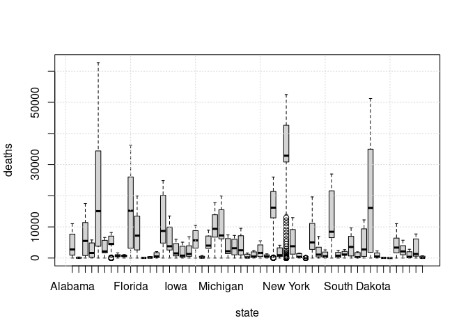
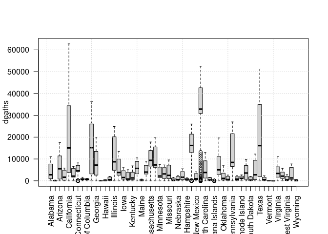
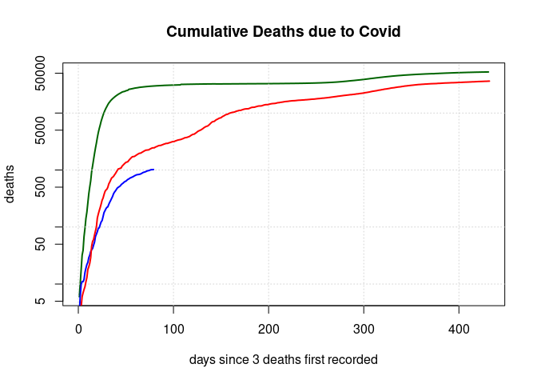
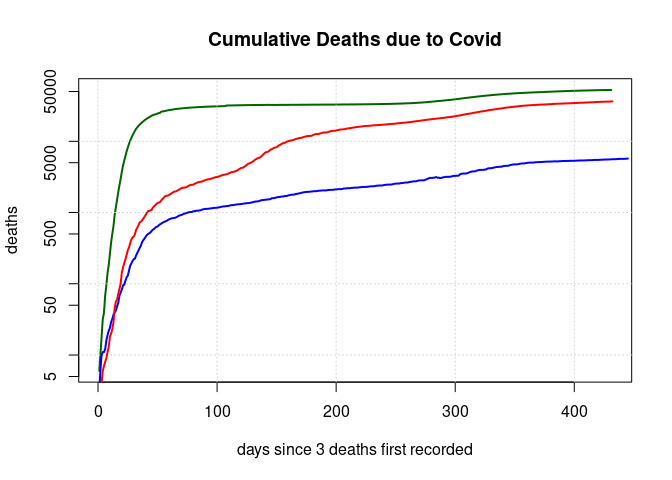
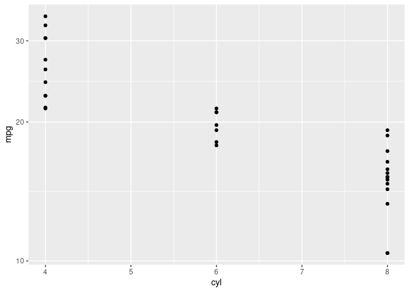

[nyt_st](https://github.com/nytimes/covid-19-data)


```r
boxplot(deaths ~ state, data = nyt_st, type="b", na.rm=TRUE);grid()
```

<!-- -->

Erstellen Sie einen boxplot: Number of deaths per state. Was faellt Ihnen auf bzgl. der absoluten Zahlen. Wie koennte man die x-labels rotieren ?

```r
boxplot(deaths ~ state, data = nyt_st, las=2, xlab="");grid()
```

<!-- -->

```r
par("mar")
```

```
## [1] 5.1 4.1 4.1 2.1
```

```r
par(mar = c(7, 4.1, 2.1, 2.1))

# sum(nyt_st$deaths)
# cumsum()
# diff()
```


```r
states <- nyt_st %>%
  filter(state %in% c("New York","Florida","Washington"), diff(c(0, deaths)) >= 3) %>%
  arrange(date)

plot(subset(states, state == "New York")$deaths, log = "y", type= "l", xlab = "days since 3 deaths first recorded", ylab = "deaths", lwd = 2, col = "darkgreen", main = "Cumulative Deaths due to Covid");grid()
lines(subset(states, state == "Washington")$deaths, lwd = 2, col = "blue")
lines(subset(states, state == "Florida")$deaths, lwd = 2, col = "red")
```

<!-- -->

```r
# states %>% group_by(state) %>% summarise(min(date))
```


```r
states <- nyt_st %>%
  filter(state %in% c("New York","Florida","Washington"), deaths >= 3) %>%
  arrange(date)

plot(subset(states, state == "New York")$deaths, log = "y", type = "l", xlab = "days since 3 deaths first recorded", ylab = "deaths", lwd = 2, col = "darkgreen", main = "Cumulative Deaths due to Covid");grid()
lines(subset(states, state == "Washington")$deaths, lwd = 2, col = "blue")
lines(subset(states, state == "Florida")$deaths, lwd = 2, col = "red")
```

<!-- -->

```r
p <- ggplot(mtcars, aes(cyl, mpg)) + geom_point()
p + scale_y_log10()
```

<!-- -->
