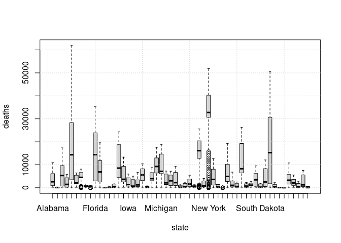

Deaths by State
================
Sebastian Knoche
05/03/2021

Erstellen Sie einen boxplot: Number of deaths per state. Was faellt
Ihnen auf bzgl. der absoluten Zahlen. Wie koennte man die x-labels
rotieren ?

``` r
boxplot(deaths ~ state, data = nyt_st, type="b", na.rm=TRUE);grid()
```

<!-- -->
